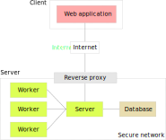

#######################
 Architecture overview
#######################

The OPCAIC platform consists of several components:

- ``webapp`` - Modern React.JS-based web frontend application
- ``server`` - Application server written in ASP.NET Core 3.0
- ``worker`` - Worker application for distributed processing of to be used by the ``server``,
  written in .NET Core 3.0

These components can be developed/deployed independently. Additionally, the platforms requires a SQL
database (currently `PostgreSQL <https://www.postgresql.org>`_). Figure :ref:`platform-arch-fig`
shows overall architecture of the platform and how individual components interact with each other.

.. _platform-arch-fig:

   The overal architecture of the platform.

The ``webapp`` repository resides in its own `GitHub repository
<https://github.com/opcaic/web-app>`_, ``server`` and ``worker`` components share a `single
repository <https://github.com/opcaic/server>`_ to simplify development.

