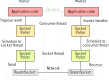

#############################
Backend workload distribution
#############################

All match execution and user's submission validation is is delegated from the *server* component to
instances of the *worker* component. The server sends a worker a message with describing the task to
be executed, and waits until worker reports task completion. In the following text, we will refer to
the load-balancing part on the web server as a *broker*, and by *worker* we will mean the part of
worker executable which communicates with the broker

The broker and worker communication is implemented using `NetMQ
<https://netmq.readthedocs.io/en/latest/>`_ library, which is a native implementation of the `ZeroMQ
<https://github.com/zeromq/netmq`_ messaging framework for .NET. Unlike other messaging frameworks,
like ActiveMQ or RabbitMQ, this messaging framework does not require standalon broker process, and
since the NetMQ implementation distributed with the platform, there is no requirement for ZeroMQ to
be installed on the target machines.

The NetMQ messaging framework is very lightweight and lowlevel and should be regarded as
implementation detail of the backend communication. Following sections describe the abstractions
build on top of the NetMQ framework to be used by the rest of the platform.

**********
Connectors
**********

The accesses to the raw NetMQ sockets is encapsulated in *connector* classes. There are two separate
connector implementations: ``BrokerConnector`` and ``WorkerConnector``. These classes utilize the
ZeroMQ *router* and *dealer* sockets, respectively. The main job of these classes is to manage these
sockets, send heartbeat messages and convert the sent and received messages between objects and
ZeroMQ frames.

The connectors API allows users to send any serializable object. Receiving messages is done by
registering *handlers* for the particular message object type by calling ``RegisterHandler`` and
``RegisterHandlerAsync``. The difference between the two is that the "sync" version gets invoked on
the same thread which monitors the socket and therefore the work done by the registered handlers
should be very short in order not to delay heartbeats.

The async handler gets called on different thread and does not block the socket thread. See
threading model below for more information. The registered handler is invoked when a message of
given type is received. Handlers have the form of simple ``Action<TMessage>`` on worker, and
``Action<string, TMessage>`` on broker. The first argument in the broker version is the identifier
of the worker who sent the message.

Connector classes threading model
=================================

Each connector uses two threads to manage the communication. Throughout the codebase, these threads
are called the *socket* thread and the *consumer* thread. The socket thread is the only thread that
is accessing the underlying socket object to send or receive a message. It also takes care of
sending heartbeat messages when appropriate. The consumer thread is intended to run handlers which
for time constraints cannot be run on the socket thread (the so-called async handlers).

The communication between these two threads happens through the ``NetMQPoller`` objects. This class
allows passively waiting on multiple NetMQ socket-like objects at the same time. It also derives
from ``TaskScheduler``, so one can schedule tasks to be executed on the thread serving the
poller. Sending a message therefore involves scheduling a ``Task`` object on the ``NetMQPoller``
instance belonging to the socket thread. And when the task body is executed on the socket thread,
there is no need for further synchronization. Similarly, after a message is received by the socket
thread, a task invoking the responsible handler is scheduled on the consumer poller instance.

This means that all (async) handlers are executed on the same thread and therefore there is no
need for synchronizing accesses to data structures. Figure illustrates the process of propagating a
message from a broker to a worker:

   Interaction between threads and sockets
   
Heartbeat
=========

In order for the communication to be robust and be able to detect failure and crash of either broker
or (any) worker. The communicators implement a scheme called `Paranoid Pirate Pattern <
http://zguide.zeromq.org/php:chapter4#Robust-Reliable-Queuing-Paranoid-Pirate-Pattern>`_. In this
communication pattern, both sides periodically send messages back and forth essentially saying "I am
alive" (these are generally called *heartbeat* messages). If one side does not receive such message
for a certain period of time, e.g. three times the beat interval, then the other side is considered
dead and/or unreachable.

******
Broker
******

The ``Broker`` class wraps the ``BrokerConnector`` and implements simple loadload distribution based
on the capabilities of the workers (i.e. based on the games the workers support). Through its
interface, the rest of the server can schedule jobs to be executed on the worker machines without
needing any more specific knowledge about workers.

Threading model
===============

All public methods on the ``Broker`` class should use the ``Schedule`` helper method so that the
actual code executes on the consumer thread of the worker to avoid the need for locks and other
synchronization. Private methods can be executed only on the consumer thread by design and no
further scheduling is needed.

Load balancing
==============

The broker keeps a queue of jobs sorted by the time the job was enqueued for execution by the server
code. When a worker is available, a task is chosen such that it is the oldest enqueued job for a
game that the worker is capable of executing. In case of a worker crashes while executing a job, the
job is put back to work queue and can be later scheduled for execution on a different worker.

******
Worker
******

Situation is on the worker component side is very similar to the broker. The ``Broker`` class uses
``WorkerConnector`` as a means to receive requests from the server and send responses once the tasks
are finished.
